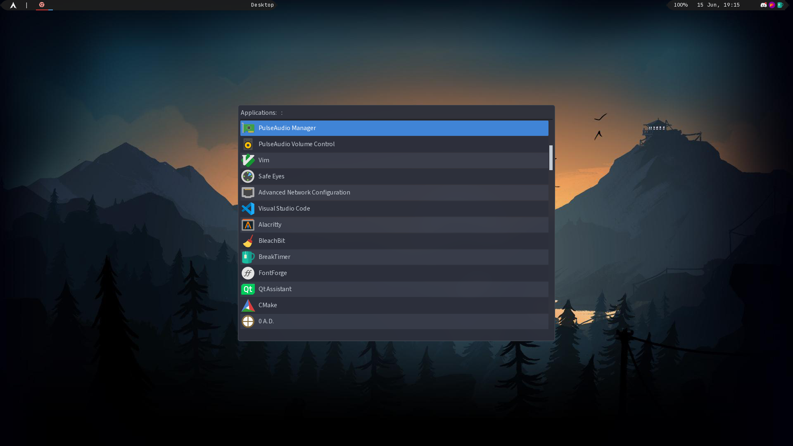
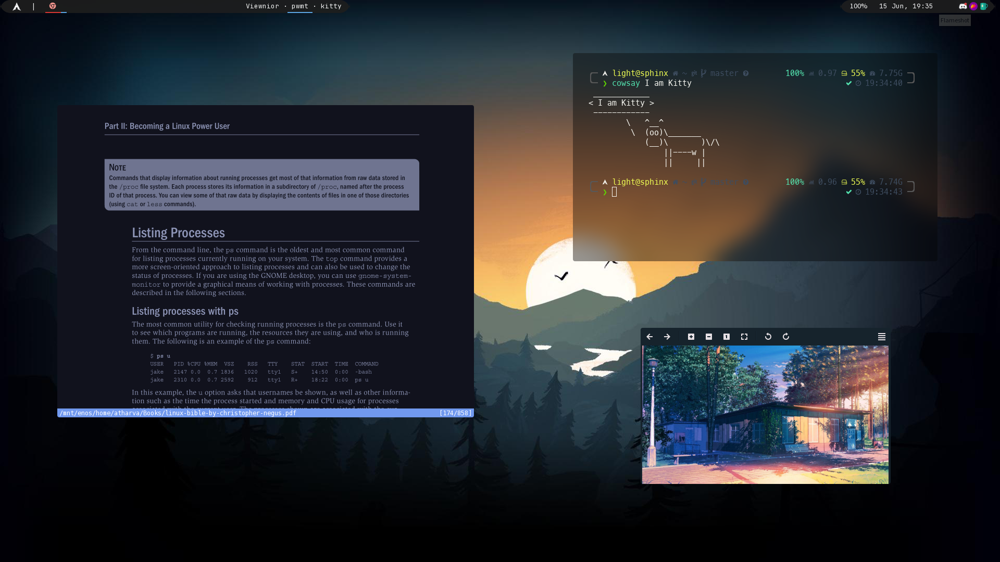

# i3_dotfiles

## Some ScreenShots.

## Features of i3 config file.

1. On switching between different workspaces you can have a wallpaper of your choice ,just change the path after (exec feh --bg-fill /path/to/your/wallpaper
Not only wallpaper but also you can add your own custom rices while changing between workspaces.
2. Dual Monitor setup.I have used xrandr for setting up my dual monitor. You can add your monitor name,port name and resolution of your choice to connect to your 2nd monitor,for getting info of this run xrandr in terminal.I would recommend you to refer to Arch Wiki incase you face any errors.
3. We have Gammy,Flameshot,BreakTimer and several other necessary apps executed in i3 config.
4. Kitty is floated by deafult in case you have a busy desktop and Alacritty(default terminal) is not floated ,so you can use them in your own covinience.
5. Mod+D for viewing GUI based softwares. Mod+Shift+D to view all installed softwares.(via rofi)
6. Some softwares fallback to a specific workspace.You can modify it any way you want.
7. I dont like weird shortcuts to execute stuff, so the config file has most of the default shortcuts given by i3wm by default.The custom shortcuts I made are pretty easy to get along with.Do give it a try!

Please Read https://i3wm.org/docs/userguide.html to feel the power of i3.

To-Do

Overviews of:

* Alacritty,Kitty
* Picom
* Polybar
* Firefox

Scripts of:

* Switching between Different Rices.
* install.sh
